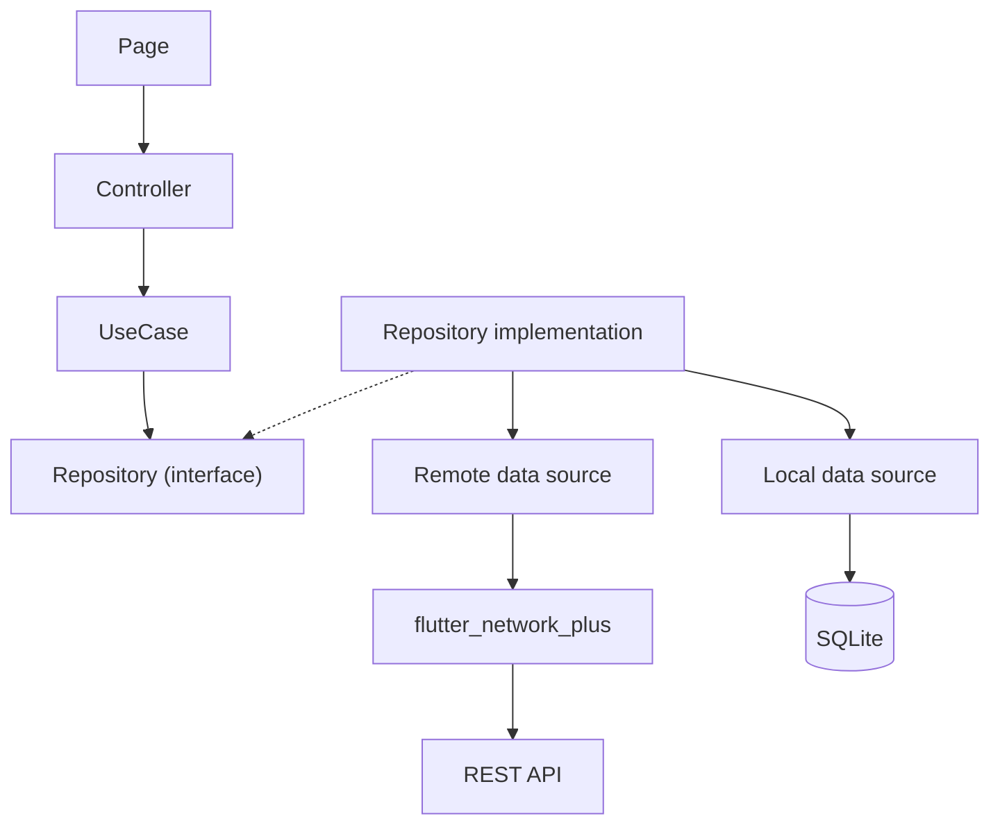

# Workspace: an enterprise Flutter architecture

A workspace and task management app, built to show how a production Flutter codebase can be structured: clean architecture, explicit state with GetX `GetBuilder`, one dependency-injection root, a dedicated networking layer, and an app that keeps working offline.

It is a complete, runnable app (sign in, projects, tasks, dashboard, profile), not a demo of isolated snippets, and it has a local mock API so you can run it without a backend.

> **Status:** the code is complete and tested (490 tests, about 94% line coverage). The GitHub workflows are written and validated but have not yet run on GitHub. See [Platforms](#platforms) for what has and has not been built and run.

## Contents

[Features](#features) · [Architecture](#architecture) · [Technology stack](#technology-stack) · [Project structure](#project-structure) · [State management](#state-management) · [Dependency injection](#dependency-injection) · [Networking](#networking) · [Authentication](#authentication) · [Offline strategy](#offline-strategy) · [Error handling](#error-handling) · [Testing](#testing) · [CI/CD](#cicd) · [Environment setup](#environment-setup) · [Running the project](#running-the-project) · [API configuration](#api-configuration) · [Platforms](#platforms) · [Design decisions](#design-decisions) · [Trade-offs](#trade-offs) · [Performance](#performance) · [Security](#security) · [Roadmap](#future-roadmap)

## Features

- **Accounts:** register, sign in, session restore at launch, sign out, automatic token refresh, forced sign out when a session cannot be refreshed.
- **Dashboard:** greeting, headline figures, pending and recently completed tasks, recent activity, quick actions.
- **Projects:** searchable list with progress, detail with a preview of the project's tasks.
- **Tasks:** list with debounced search, status and priority filters, sorting, infinite scroll and pull to refresh; detail with attachments and activity; create, edit and delete; quick status and priority changes.
- **Profile:** edit name and phone, choose a light, dark or system theme (remembered), sign out.
- **Offline:** saved data when the server is unreachable, changes made offline kept and sent later, clear indicators for "waiting to sync" and "not saved".
- **Every screen** handles loading, empty, error, refreshing and submitting states, adapts from phone to desktop, and tolerates large text.

## Architecture



Three layers (presentation, domain, data) with dependencies pointing inward. Pages hold no logic, controllers hold presentation state only, use cases hold business rules and validation, repositories decide where data comes from, and data sources talk to the network or the database. Details in [plans/docs/architecture.md](plans/docs/architecture.md).

## Technology stack

| Concern | Choice |
|---|---|
| Framework | Flutter 3.47 (Dart 3.13), Material 3 |
| State | GetX: `GetxController` and `GetBuilder` only |
| Dependency injection | One composition root, `GetDI` (no Bindings) |
| Networking | [`flutter_network_plus`](https://github.com/nikhilrpadhiyar/flutter_network_plus) 0.1.0 for every request |
| Local storage | Drift (SQLite) |
| Value equality | `equatable` |
| Dates | `intl` |
| Tests | `flutter_test`, `mocktail`, `fake_async`, `integration_test` |

## Project structure

```text
lib/
  core/        config, failures, logging, theme, shared widgets, routes, constants
  domain/      entities, requests, validators, repository interfaces, use cases
  data/        models, remote and local data sources, repositories, offline sync
  features/    auth, dashboard, profile, projects, settings, shell, splash, tasks
               each with controllers/, pages/, widgets/
  di/          get_di.dart, the composition root
  main.dart    GetDI.init() then runApp
tool/mock_server/   local implementation of the API contract
test/ integration_test/
plans/        planning documents and architecture docs (plans/docs)
```

## State management

State lives in plain Dart fields; the UI rebuilds only through `GetBuilder` with explicit `update([ids])`. There is no `Obx`, `.obs`, `Rx` type, GetX worker or Binding anywhere, and a script fails the build if one appears. See [plans/docs/state-management.md](plans/docs/state-management.md).

## Dependency injection

`lib/di/get_di.dart` creates everything in order: infrastructure, network, data sources, repositories, use cases, controllers. Controllers never build their dependencies and routes declare no bindings. Tests build the same graph with in-memory fakes through `GetDIOverrides`. See [plans/docs/dependency-injection.md](plans/docs/dependency-injection.md).

## Networking

All HTTP goes through `flutter_network_plus`; there is no Dio, `http` or GetConnect. The package supplies authentication with token refresh, retries, a circuit breaker, response caching, the offline queue, SSL pinning and a mock transport. The app adds a thin requester that turns results into app failures, and one factory that builds the client from configuration. The package's behaviour was verified from its source, and the limitations found are documented in [plans/docs/networking.md](plans/docs/networking.md).

## Authentication

Login and registration store the issued tokens in the package's secure storage; the package attaches them, refreshes them once for any number of concurrent requests (before expiry and on 401), replays the request, and signs the user out when refresh fails. Controllers never see a token. The route guard (`AuthMiddleware`) sends signed-out users to sign in, and the session controller returns an expired session to the sign in screen with a notice.

## Offline strategy

Tasks are read from the server and copied to a local database. When the server cannot be reached, the app answers from the database and marks the data as saved. Writes are recorded locally first, shown at once, and sent by the package's persistent queue when the connection returns; a rejected change stays visible and can be discarded. The package queue cannot be emptied, so a guard stops one account's waiting changes from being sent under another. See [plans/docs/offline-first.md](plans/docs/offline-first.md) for the flows and limits.

## Error handling

Every error that crosses a layer is a `Failure` with a user-safe message (network, offline, timeout, authentication, forbidden, not found, validation with per-field messages, server, parsing, cache, unknown). Raw exceptions never reach the UI, and errors never expose tokens in logs.

## Testing

490 tests: unit tests for domain, data and controllers; widget tests for every screen in every state; a full user journey on three screen sizes; and the same journey in a real window against the mock server over HTTP. The network is exercised for real through the package's mock transport rather than being mocked away. See [plans/docs/testing.md](plans/docs/testing.md).

```bash
flutter test                              # unit, widget and flow tests
flutter test --coverage
flutter test integration_test -d macos    # the device journey (or an emulator id)
./tool/check_forbidden_patterns.sh        # architecture rules
```

## CI/CD

`.github/workflows`: `analyze.yml` (format, analyzer, architecture rules, generated code up to date), `test.yml` (tests with coverage and the device journey on macOS) and `build.yml` (Android release APK, plus macOS, iOS without signing, Windows and Linux). Release signing and the SSL pins come from GitHub Secrets and the API URL from a repository variable; nothing is committed. The workflows have not run on GitHub yet.

## Environment setup

Requirements: Flutter 3.47 or newer (Dart 3.13), and for Android or iOS the usual platform toolchains.

```bash
flutter pub get
cp env/development.example.json env/development.json
```

Environment files are JSON passed with `--dart-define-from-file`:

| Key | Meaning |
|---|---|
| `ENV_NAME` | `development`, `staging` or `production` |
| `API_BASE_URL` | Base URL of the API. Must be HTTPS in production |
| `SSL_PINS` | Optional comma separated SPKI SHA-256 pins |
| `ENABLE_HTTP_LOGGING` | `true` to log requests and responses (redacted) |

Real `env/*.json` files are git-ignored; `env/*.example.json` and `.env.example` document the keys. The Drift code is generated and committed; regenerate it with `dart run build_runner build` after changing the schema.

## Running the project

1. Start the local API in one terminal:

   ```bash
   dart run tool/mock_server/main.dart
   ```

   It listens on port 8080 and prints the demo login. Options: `--port`, `--token-seconds` (short values exercise token refresh) and `--delay-ms` (makes loading states visible).

2. Run the app in another:

   ```bash
   flutter run --dart-define-from-file=env/development.json
   ```

   Sign in with **demo@example.com** and **Password1**, or register a new account.

On an Android emulator the host is `10.0.2.2`: set `API_BASE_URL` to `http://10.0.2.2:8080/v1` in `env/development.json`. Debug builds allow plain HTTP for the local server; release builds do not.

## API configuration

The app talks to any server that follows [plans/docs/api-contract.md](plans/docs/api-contract.md): authentication (login, register, refresh, logout), profile, projects, tasks (filters, sorting, paging, create, update, delete), users and a dashboard summary. Point `API_BASE_URL` at it. The mock server implements the contract in memory, including token expiry and refresh, validation errors and idempotency keys.

## Platforms

| Platform | State |
|---|---|
| Android | Release build verified; the full journey test passes on an Android emulator (Pixel 10 image). Release signing from secrets verified with a test key |
| macOS | Debug build verified; the full journey test passes in a real window. Persisting tokens in the keychain needs a developer team (see [security](plans/docs/security.md)) |
| iOS | Unsigned release build verified; not run (no simulator runtime on the development machine) |
| Windows, Linux | Configured, not built |
| Web | The project compiles for web but **the app cannot run there**: the networking package does not support web in 0.1.x |

## Design decisions

Why each major choice was made is written down: [architecture](plans/docs/architecture.md), [state management](plans/docs/state-management.md), [dependency injection](plans/docs/dependency-injection.md), [networking](plans/docs/networking.md), [offline first](plans/docs/offline-first.md), [testing](plans/docs/testing.md), [security](plans/docs/security.md). The step-by-step plans the project was built from are in [plans/](plans/).

## Trade-offs

- **Explicit rebuilds** mean more `update([ids])` calls than reactive state, in exchange for behaviour that is easy to read and test.
- **A local database plus the package cache.** Tasks need queries and unsent changes, so they use the database; other reads use the package's response cache, which serves saved data after any failed read, including 403 and 404, with a notice.
- **Last write wins** for conflicts; there is no merge.
- **The database is not encrypted.**
- **Adaptive layout, not master/detail.** Wide screens use a rail and a width-limited column.
- **Offline lists hold only what was downloaded**, and a task created offline cannot be edited until it syncs.

## Performance

Lists use `ListView.builder` with stable keys and load pages of 20 on demand; rebuilds are limited with update ids; searches are debounced and stale responses are ignored; Drift queries filter and sort in SQLite; response caches have a time limit and size cap; images are not used. Overflow and large text are covered by tests.

## Security

Secrets are never committed; tokens live in secure storage and never in logs; production requires HTTPS with optional pinning; logs are redacted; one account's data is removed when another signs in. Known gaps (unencrypted database, macOS keychain entitlement) are listed in [plans/docs/security.md](plans/docs/security.md).

## Future roadmap

- Web support through a fetch-based transport for the networking package.
- Two-pane master/detail on wide screens.
- Encrypted local database.
- Clearing an assignee when editing, and creating projects (needs API support).
- Localization and a settings area.
- Push notifications and attachment upload.
- More offline resilience: pull a task for editing in the background so it can be edited offline.

## Contributing and licence

See [CONTRIBUTING.md](CONTRIBUTING.md) and [CHANGELOG.md](CHANGELOG.md). Released under the [MIT licence](LICENSE).
